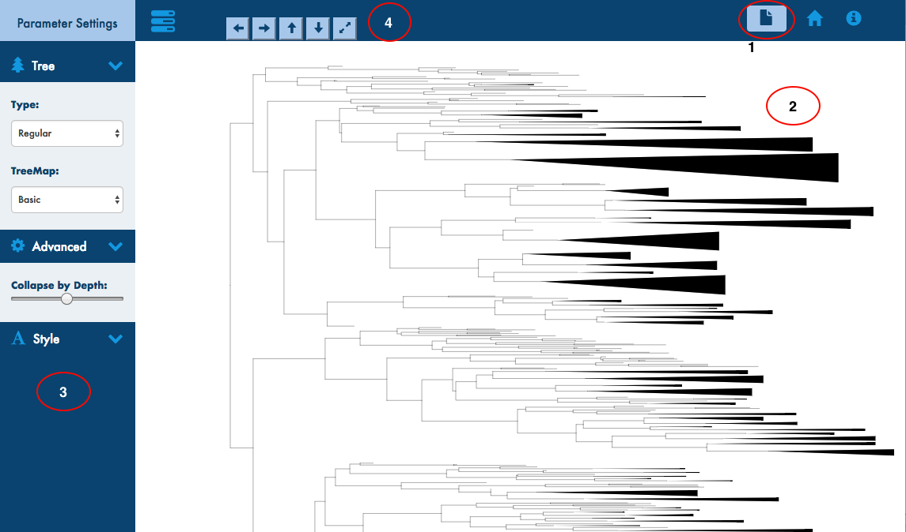

# **phyXplorer**

phyXplorer interface allows to visualize and explore the newick formatted phylogenetic trees based on different hierarchical data visual designs (node-link, treemap and a hybrid layout) in browser.

# **Browser Requirements**

phyXplorer uses JavaScript, HTML5 and svg element to visualize the phylogenetic tree. So it recommended to use modern browsers like chrome, firefox and safari, however, it is highly recommended to use Google Chrome as the application has been extensively tested in Chrome at the moment and also seem to offer the best performance.

# **Data format**

At the moment all the interfaces within phyXplorer only supports <a href="http://evolution.genetics.washington.edu/phylip/newicktree.html">Newick</a> formatted phylogenetic tree. Upload only the tree file in Newick tree format as below.

<b>Example trees 
</b>
<ul>
<li>(B:6.0,(A:5.0,C:3.0,E:4.0):5.0,D:11.0);
<li>((A,B),(C,D));
</ul>

# **Interface**

The user interface is quite similar for different tree layout/visualizations that comes as a part of phyXlporer and the different sections of the interface are outlined below

### 1. Tree Input

The glyphicon on the navbar in the top right where the end user uploads the tree in "Newick" format as described above

### 2. Main Tree Display (Visualization)

Normally the div where the tree is rendered or displayed is in the center to the left of the paramters control and just below the navigation bar on the top

### 3. Parameters Control

Displays all html elements to control the tree related parameters in display level such as dendogram or regular phylogram; Also the input to collapse the depth of the tree and other styling attributes
depending on the display layout chosen

### 4. Size Control

Used to change the display size of the tree such as increase the width and height of the tree and the viceversa

# **Tree Layout Designs**

### 1. Depth Collapse Tree Layout

### 2. Hybrid Tree Layout

### 3. Degree of Interest Tree Layout

### 4. TreeMap Layout

# **Code Flow & How it Works** #

The four key blocks of each app is "reading and parsing data", "apply initial settings", "core computations" and "render/draw". The flow is more or less the same across the different visual layout JavaScript files

